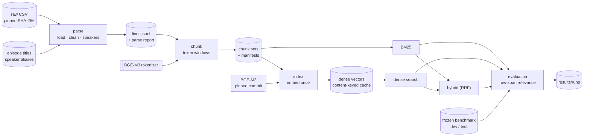

# SexAndRag: a retrieval benchmark on noisy TV dialogue

SexAndRag is a **retrieval benchmark and pipeline**, not a chatbot. It takes a messy, semi-structured
dataset (every subtitle line of *Sex and the City* as ordered rows with speaker labels) and measures
how well lexical, dense and hybrid retrieval find the exact lines that answer a question.

```
messy dialogue dataset            ordered subtitle rows: typos, split turns, tuple-encoded rows, label noise
        ↓
deterministic normalization       small named rules, each change recorded, every line keeps its source row
        ↓
token chunking                    whole lines packed into 256 / 512 / 1024-token windows with overlap
        ↓
BM25 / dense / hybrid retrieval   Okapi BM25, exact cosine search over BGE-M3 vectors, Reciprocal Rank Fusion
        ↓
controlled evaluation             60 human-approved questions scored against row-level evidence; frozen dev/test split
        ↓
failure analysis                  per-query rankings, where retrievers disagree, sensitivity to chunk size
```

**Retrieval is what is measured here.** Retrieval evaluation asks whether the lines that answer a
question are among the top-ranked chunks. Answer-generation evaluation asks whether a language model,
given those chunks, writes a correct answer. It is a separate question, and it is deliberately out of
scope. Generation will be added as its own layer, with its own evaluation, only after the retrieval
baseline and the held-out test are final. This repository calls no LLM at all.

## What the project demonstrates

- **Data engineering on messy input.** Subtitle text and speaker labels are cleaned conservatively,
  one named rule at a time. The raw text and label stay beside the cleaned ones. Nothing is inferred
  with an LLM: episodes are the only authoritative structure, and missing screenplay structure
  (scenes, locations, stage directions) is not invented.
- **Provenance end to end.** Every line, chunk, search result and eval target points back to exact
  source rows, so relevance is judged independently of chunk size.
- **Honest evaluation design.** Every question and its evidence were approved by a human reviewer.
  Scoring uses only answer-bearing row spans, with explicit ALL/ANY evidence groups, and premise
  evidence is never scored. The dev/test split is frozen with hashes, and the code refuses held-out
  runs unless they are explicitly allowed.
- **Reproducibility and supply-chain hygiene.**
  - Pinned: the corpus checksum, library versions, and the model commit with a digest for every model file.
  - Caches are keyed by exact content and checked on load.
  - Unchanged inputs give identical rankings.
- **Production engineering.**
  - One validated configuration layer, one CLI, logging, and errors that explain how to recover.
  - Four test levels and a strict quality gate (Ruff, mypy `--strict`, pytest).
  - CI that needs neither the corpus nor the model.

## Architecture



Module-by-module details: [docs/architecture.md](docs/architecture.md). Benchmark schema and
rules: [docs/evaluation.md](docs/evaluation.md).

## Data pipeline

| Stage | What happens | Output (local, git-ignored) |
|---|---|---|
| **Verify** | The raw CSV must match the pinned SHA-256 (Kaggle dataset version 3). Any other file is refused, because its rows would not line up with the eval targets. | none |
| **Parse** | Rows are repaired: tuple-encoded rows unpacked, blank episode ids filled only when both neighbours agree, empty rows dropped. Text is cleaned by small named rules (typography, OCR `l`→`I`, subtitle dashes). A row holding two speakers' turns is split, and both turns are left unattributed rather than guessed. Speaker labels are normalized with an alias file where every mapping cites its evidence; ambiguous names are mapped only in listed episodes. | `data/processed/lines.jsonl`, `parse_report.json` |
| **Chunk** | Whole lines are packed into windows counted in BGE-M3 tokens, with overlap, never crossing an episode boundary. Chunk text is `Speaker: line`; episode titles stay metadata. | `data/processed/chunks/tok512o64-bge-m3.jsonl` plus a manifest of settings and hashes |
| **Index** | Every chunk is embedded once with the pinned model. Anything longer than the model's context is an error, never truncated. Index writes are atomic. | `index/dense/<chunk set>/bge-m3-<key>/` |
| **Scenes** (optional) | A deterministic speaker-turnover heuristic groups lines into *inferred* scenes. They are metadata only, never evidence, and the pipeline works with them off. | `data/processed/scenes_inferred.jsonl` |

The current corpus parses from 39,999 CSV records into 39,850 dialogue lines over 94 episodes. Chunking
gives 2,394, 1,218 and 621 chunks at 256, 512 and 1,024 tokens.

## Retrieval methods

All retrievers share one interface, `search(query, k, filters=None) -> list[SearchResult]`. Each
result carries its chunk id, season, episode, title, source-row span, speakers, score, rank and method.

- **BM25:** `rank_bm25` Okapi over lowercased `[a-z0-9]+` tokens, with k1 = 1.5 and b = 0.75.
  - IDF is clamped at 0, so very common words carry no weight.
  - Only chunks that share an informative query term are returned.
- **Dense:** BGE-M3 (CLS pooling, normalized, 1,024 dimensions) with exact cosine search over every
  chunk vector.
  - The same model embeds all three chunk sizes, so chunk size is the only thing that varies.
  - There is no approximate index and no vector database; at this corpus size, exact search is
    the honest baseline.
- **Hybrid:** Reciprocal Rank Fusion of the BM25 and dense top 30, scored as sum 1 / (60 + rank).
  Only ranks are fused; raw scores from the two retrievers are never added.
- **Determinism:** scores are rounded to 12 decimals. Exact ties break by a fixed hash order of chunk
  ids rather than file order, so reruns are identical and no season or retriever is favoured.

## Evaluation methodology

- **Ground truth:** 60 questions over six types: who said, scene fact, character, episode, sequence
  and arc.
  - Candidates were drafted with proposed evidence, then approved by a human reviewer.
  - Every claim in a question's premise and in its expected answer must be stated in the cited lines.
    Speaker labels count as evidence (they are part of the indexed text); inferred scenes never do.
- **Relevance:** a retrieved chunk is relevant when it is from the same episode and its rows overlap
  an answer-bearing target span. Being in the right episode is never enough.
- **Evidence groups:** an `all` group needs every target, for example a sequence question's anchor
  and its answer. An `any` group accepts alternatives. Premise spans justify the question's wording
  and are never scored.
- **Metrics:**
  - Hit@1/5/10;
  - Recall@1/5/10, the share of required evidence found;
  - MRR@10;
  - AllTargetsHit@5/10, whether all required evidence was found, for the 28 questions that need
    more than one piece.
- **Frozen split:** 20 development questions and 40 held-out test questions, 100 scored spans in
  total.
  - The split is stratified by question type, style, season, target count and lexical overlap,
    from a recorded seed.
  - Only the development set may be used for failure analysis and tuning.
- **Discipline, enforced in code:**
  - `sexandrag eval` runs the development set only.
  - The test set needs `--split test --allow-heldout`.
  - Copies, subsets or renamed test items are refused without that flag.
  - Allowed held-out runs are logged and recorded as such.

Full schema, worked examples and the rules: [docs/evaluation.md](docs/evaluation.md).

## Reproducibility

- **Pinned inputs:** the corpus SHA-256 and Kaggle dataset version, the BGE-M3 commit and each model
  file's digest, and exact library versions (`pyproject.toml` plus `constraints.txt`).
- **Model supply chain:**
  - Only a pinned 40-character commit hash is accepted; branch names, tags and `refs/pr/N` are refused.
  - `sexandrag model download` is the only command that uses the network for the model. Every other
    command loads from the local cache with the hub forced offline.
  - `trust_remote_code` is always off.
  - After loading, the module stack, pooling mode, dimension and context length are checked. Any
    difference is an error, never a silent fallback.
- **Artifacts:**
  - Chunk sets carry manifests: tokenizer, settings, and hashes of their input and output.
  - Dense indexes are keyed by a hash of exactly what was embedded plus the model identity, and are
    checked on load.
  - A stale, corrupt or half-written artifact is an error that names the command that rebuilds it.
- **Runs:**
  - Every evaluation run writes a new directory under `results/runs/` holding the configuration,
    metrics, per-query rankings, library versions, git commit and dirty state, input hashes and timing.
  - Runs are never overwritten, and they store row spans and chunk ids, not dialogue text.
- **Checked after the package refactor:** re-parsing and re-chunking the corpus reproduced
  `lines.jsonl` and all three chunk sets and manifests byte for byte. The model tests confirm that
  re-embedding a chunk reproduces its cached vector.

## Data and license

- **This repository does not contain or distribute the transcript corpus.** Obtain it yourself from
  its source, the Kaggle dataset
  [snapcrack/every-sex-and-the-city-script](https://www.kaggle.com/datasets/snapcrack/every-sex-and-the-city-script)
  (version 3), under that dataset's terms. `sexandrag download` fetches it into `data/raw/`.
- **What Git holds:** code, tests, documentation and small metadata the project created. That covers:
  - episode titles, taken from Wikipedia's *List of Sex and the City episodes*;
  - the speaker-alias table;
  - chunk-set manifests, which hold only settings and hashes;
  - the evaluation questions.
- **What Git never holds:** the raw CSV and everything derived from it (lines, chunks, scenes, review
  sheets), indexes, model weights and run outputs. `scripts/check_repo_hygiene.py` fails the build if
  any of these would be committed.
- **Eval files quote only a few words per target** (`expected_quote`), which is just enough to check
  provenance. Documentation and tests use an invented mini-corpus rather than dialogue from the show.
- **License: none chosen yet.** When one is added, it will cover this repository's code and
  documentation only. It grants no rights to the transcript corpus, and implies no ownership or
  relicensing of it. The corpus and the BGE-M3 weights each stay under their own terms.

## Running locally

### Quick start: understand the project without the data

```bash
git clone <this repository> SexAndRag && cd SexAndRag
python3 -m venv .venv && source .venv/bin/activate
make install        # CPU-only torch first, then: pip install -e ".[dev]" -c constraints.txt
make check          # format, lint, mypy --strict, all tests, frozen-benchmark hashes, repository hygiene
```

- `make check` needs neither the corpus nor the model. Its integration tests drive every command
  through the real CLI on an invented four-episode corpus in `tests/fixtures/synthetic/`.
- Suggested reading order: this README, then [docs/architecture.md](docs/architecture.md), then
  [docs/evaluation.md](docs/evaluation.md).
- To try the commands yourself, copy the synthetic corpus to a temporary folder. Parsing and BM25
  search need no model; chunking needs only the model's tokenizer, about 22 MB:

```bash
cp -r tests/fixtures/synthetic /tmp/sexandrag-demo
sexandrag --root /tmp/sexandrag-demo parse
sexandrag model download --tokenizer-only
sexandrag --root /tmp/sexandrag-demo chunk --all
sexandrag --root /tmp/sexandrag-demo search "where did they find the lost dog" --method bm25
```

### Full setup: from a clean clone to a working retrieval system

**1. Python.** 3.12 or newer is required; the classifiers list 3.12 to 3.14. The project was developed
and tested locally on Python 3.14.4 under Linux x86-64. The CI workflow is configured for 3.12 and
3.14. A CPU is enough, and no GPU is used or needed.

**2. Environment.**

```bash
git clone <this repository> SexAndRag && cd SexAndRag
python3 -m venv .venv && source .venv/bin/activate
```

**3. Installation.** Install CPU-only torch first, so that pip never pulls the multi-gigabyte CUDA
build. Then install the package with the tested versions of every dependency:

```bash
pip install torch==2.14.0 --index-url https://download.pytorch.org/whl/cpu
pip install -e ".[dev,download]" -c constraints.txt     # "download" adds kagglehub for step 4
sexandrag --version
```

**4. The corpus.** Kaggle may ask you to sign in: kagglehub reads `~/.kaggle/kaggle.json` or the
`KAGGLE_USERNAME` and `KAGGLE_KEY` variables.

```bash
sexandrag download        # fetches dataset version 3 into data/raw/SATC_all_lines.csv
```

Alternatively, download version 3 from the Kaggle page yourself and put `SATC_all_lines.csv` in
`data/raw/`.

**5. Checksum verification.** Both `download` and `parse` check the file against the pinned SHA-256,
and a mismatching download is deleted again. To check it on its own:

```bash
sexandrag verify --only corpus
```

**6. Parsing.**

```bash
sexandrag parse           # data/processed/lines.jsonl; add --report for the full parse report
```

**7. Chunk generation.** Chunk sizes are counted in the embedding model's own tokens, so chunking
needs its tokenizer (about 22 MB):

```bash
sexandrag model download --tokenizer-only
sexandrag chunk --all     # the 256/32, 512/64 and 1024/128 chunk sets, with manifests
```

**8. Model acquisition.** This is the only networked model step. It fetches about 2.3 GB, and every
file is checked against its pinned digest:

```bash
sexandrag model download
sexandrag model verify    # digests and structure (add --deep to hash the 2.3 GB weights again)
```

The files go to the standard Hugging Face cache, or to `paths.model_cache_dir` if you set one.

**9. Index construction.** Indexing is explicit and slow on CPU. Each chunk size took about 21
minutes on the development machine's CPU, using 8 threads (the recorded build times are 1,247 to
1,327 seconds).
Reruns reuse a valid cache; `--rebuild` forces a new build.

```bash
sexandrag index --all
sexandrag verify          # corpus, metadata, lines, chunks, indexes, model files, frozen benchmark
```

**10. Searching.**

```bash
sexandrag search "who was asked to walk in a charity fashion show" --method hybrid --size 512 -k 5
sexandrag search "..." --method bm25 --season 2 --speaker Miranda     # optional metadata filters
sexandrag inspect s04e13-tok512o64-003                                  # one chunk with full provenance
```

On the development machine, loading the model and embedding a first query took about 6 seconds,
with the model files already in the OS file cache. Memory peaked at about 2 GB resident.

**11. The development benchmark.** Run this only when you start retrieval analysis. It evaluates
the development set with every chunk size and retriever:

```bash
sexandrag eval            # results/runs/<UTC time>-dev-<commit>[-dirty]/
```

`python -m eval.run_eval` still works and also means the development set only. The held-out test
set is not part of routine work (see [docs/evaluation.md](docs/evaluation.md)).

**12. Tests, lint and type checks.**

```bash
make check                # the whole gate, exactly as CI runs it
make test                 # unit and integration tests only
make test-model           # also the tests that load the real model (needs step 8)
make coverage             # tests with a branch-coverage report
```

### Configuration

- **Defaults** reproduce the frozen baseline; `sexandrag config show` prints the effective settings.
- **Overrides** go in a `sexandrag.toml` at the project root, or in a file passed with `--config`.
  Unknown keys, wrong types and contradictory values fail at startup, before any work is done.
- **Global options** go before the command:
  - `--root` (or `$SEXANDRAG_ROOT`) and `--config` (or `$SEXANDRAG_CONFIG`) choose the project;
  - `-v/--verbose` and `-q/--quiet` set the log level, and `--debug` also prints full tracebacks.
- **Streams and exit codes:** logs go to stderr and results to stdout. Exit codes are 0 for success,
  1 for a known error with a recovery hint, 2 for invalid usage, 70 for an unexpected internal error
  and 130 for an interrupted command.

## Testing

| Level | Where | Needs | In CI |
|---|---|---|---|
| Unit | `tests/unit` | nothing | yes |
| Integration | `tests/integration` | the invented fixture corpus (in the repository) | yes |
| Corpus | `tests/corpus` | the real corpus and its processed artifacts, locally | skipped |
| Model | `tests/model` | the real model; opt in with `--run-model` or `RUN_MODEL_TESTS=1` | skipped |

The integration tests run the whole pipeline through the CLI. Together with the unit tests,
they cover:

- **Held-out protection:** the held-out guard, including copied test files.
- **Input validation:** malformed eval items rejected at load time, before any model work; a changed
  corpus refused; invalid configuration.
- **Artifact integrity:** corrupt, stale and half-written artifacts detected.
- **Reproducibility:** repeat runs produce identical rankings and metrics.
- **CLI behaviour:** exit codes and error messages, without tracebacks.

GitHub Actions ([.github/workflows/ci.yml](.github/workflows/ci.yml)) runs the same gate as
`make check`: Ruff format and lint, mypy strict, pytest with coverage, the frozen-benchmark check and
the repository-hygiene check. It needs no dataset, Kaggle credentials, GPU, model weights or secrets.

## Current benchmark status

- **Built and verified:** the corpus is parsed, chunked at three sizes and indexed, and `sexandrag
  verify` passes on every artifact.
- **Frozen:** the 60-question benchmark and its 20/40 dev/test split, with hashes recorded in
  `eval/frozen/MANIFEST.json`.
- **Not yet measured:** there are no benchmark results yet, and none are claimed. The next step is
  the untouched baseline on the development set, followed by failure analysis. The held-out test set
  runs once, after the retrieval approach is final.

## Limitations

- **Small benchmark.** 60 questions (20 dev, 40 test) give coarse estimates, and a difference of a
  few questions is not meaningful.
- **Single reviewer.** Every question was checked line by line against the source, but there is no
  inter-annotator agreement.
- **Subtitle data, not screenplays.** There are no scene boundaries, locations or stage directions,
  and some speaker labels are missing or ambiguous. Unattributed lines stay unattributed.
- **CPU indexing is slow,** at about 21 minutes per chunk size.
- **Platform coverage.** Tested locally only on Linux with Python 3.14. The CI workflow targets 3.12
  and 3.14 but has not yet run on GitHub. macOS and Windows are untested.
- **Not yet provided:** no Docker image (native installation is the supported path) and no LICENSE
  file.

## Future work

- **Development baseline:** run the untouched baseline on the development set, and write up the
  failure analysis: where BM25 and dense retrieval disagree, and how results depend on chunk size.
- **Tuning:** tune on the development set only (fusion depth, RRF constant, BM25 preprocessing, a
  cross-encoder reranker), then run the held-out test once.
- **Answer generation:** add it as a separate, separately evaluated layer on the frozen retrieval system.
- **Docker (optional):** a CPU image that mounts the corpus, model cache and indexes as volumes and
  bakes in none of them.

## Project layout

```
src/sexandrag/             the package: CLI, configuration, parsing, chunking, model, index, retrieval
src/sexandrag/evaluation/  eval schema, metrics, held-out guard, runner, validator, split and freeze
data/meta/                 episode titles and speaker aliases (project-created metadata)
data/processed/chunks/     chunk-set manifests only (hashes); the chunks themselves stay local
eval/frozen/               the frozen benchmark, dev/test split and manifest (read-only)
eval/smoke.json            a five-item plumbing check on episodes the benchmark does not use
docs/                      architecture and evaluation guides
tests/                     unit, integration, corpus and model tests, plus the invented fixture corpus
scripts/                   the quality gate and the repository-hygiene check
results/                   run outputs (local; see results/README.md)
```
