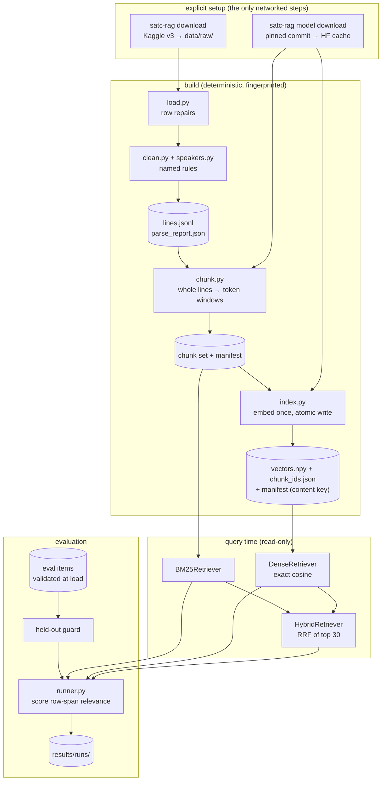

# Architecture

SATC-RAG is a pipeline of explicit steps. Each step reads the previous step's artifact, checks that
it is the artifact it expects, and writes its own artifact together with a fingerprint. No step builds
anything implicitly: retrieval never builds an index, and evaluation never re-chunks.

Four principles hold throughout:

- **Source-grounded:** the index contains only the source dialogue. There are no generated summaries,
  no inferred structure, and no LLM calls anywhere.
- **Deterministic:** the same inputs always produce identical artifacts, rankings and metrics.
- **Provenance everywhere:** every line, chunk, result and eval target traces back to exact source rows.
- **Fail loudly:** a missing, stale, corrupt or unexpected input stops the run with an error that says
  what was expected, what was found and how to fix it. Nothing falls back silently.

## Module map

| Module | Responsibility |
|---|---|
| `config.py` | One validated settings object. The defaults are the frozen baseline, overridable from a TOML file. |
| `errors.py`, `logs.py` | Focused exceptions with recovery hints; logging to stderr. |
| `download.py`, `load.py`, `parse.py` | Fetching the corpus, verifying its checksum, repairing rows, writing `lines.jsonl`. |
| `clean.py`, `speakers.py`, `episodes.py` | Text rules, speaker-label normalization, episode titles. |
| `scenes.py` | Optional inferred scenes (metadata only). |
| `tokens.py`, `chunk.py` | Token counting with the model's tokenizer; chunking; chunk-set manifests. |
| `model.py`, `embedders.py`, `services.py` | Model supply chain: pinned files, offline loading, verification; embedding with no truncation. |
| `artifacts.py`, `index.py`, `jsonl.py` | Artifact identities and hashes; the dense index cache; atomic JSON and JSONL I/O. |
| `retrieve.py` | BM25, dense and hybrid retrievers behind one interface. |
| `provenance.py` | Row spans, overlap-based relevance, quote lookup. |
| `evaluation/` | The item schema, metrics, held-out guard, runner, results layout, validator, and freeze/split. |
| `verify.py`, `environment.py` | Checks on every artifact; library versions and git state for run records. |
| `cli.py` | The `satc-rag` command: one handler per subcommand, and the exit codes. |

## Ingestion

- **Obtaining the corpus.** `satc-rag download` fetches version 3 of the Kaggle dataset with kagglehub.
  - The file must match the SHA-256 pinned in the configuration. A download that does not match is
    deleted again.
  - An existing different file is only replaced with `--force`.
  - The repository never contains the corpus.
- **Checking it again.** `parse` repeats the checksum check. A different file would shift source rows
  and silently invalidate every eval target, so it is refused.
  - `--allow-unverified-corpus` exists for experimenting with another version, and it logs a warning.
- **Row repairs** (`load.py`) change row structure but never text. Each repair is recorded on the row
  and counted in the parse report:
  - one episode (S6E3) stores `(speaker, line)` as a Python tuple literal in the index column; these
    rows are unpacked;
  - empty padding rows (no speaker and no text) are dropped;
  - a blank season or episode is filled only when the nearest complete rows on both sides agree;
  - where the per-episode index column holds a tuple instead of a number, `source_row` is rebuilt
    from the row's position in the episode, the same numbering every other episode uses.

## Normalization

Text rules are small, named functions. They are applied in a fixed order, and the name of every rule
that changed a line is stored with it:

| Stage | Rules |
|---|---|
| Whole row | `whitespace`, `typography` (curly quotes and dashes to ASCII), `ocr_l_as_I` and `ocr_caps_l` (OCR confusions of `l` and `I`), `merged_words`, `missing_space`, `orphan_quote` |
| Each turn | `leading_dash`, `trailing_dash` (subtitle turn markers), `whitespace` |

- **Splitting rows into turns.** A row holding two speakers' turns (invented example:
  `- Hello? - It's me.`) is split into two lines, but only at a subtitle turn marker: sentence-final
  punctuation followed by ` - `.
  - The dataset's single label could belong to either turn, so both turns get `speaker: null`
    rather than a guess.
  - The switch `corpus.split_turns_keep_label_on_first` exists for an explicit ablation.
- **Speaker labels.** Each label goes through the same steps, in order:
  1. tidy it: whitespace, wrapping parentheses, numbering such as `Woman #1`;
  2. split a multi-speaker label such as `Carrie, Miranda` into its names;
  3. for each name, apply the casing variant;
  4. apply an episode-scoped alias;
  5. apply a global alias.
- **The alias file.** `data/meta/speaker_aliases.json` gives the evidence for every alias. Ambiguous
  first names are mapped only in the episodes listed. A label that cannot be identified stays as it is.
- **What is never done:** rewording, grammar or style fixes, and inferring missing speakers, scene
  headings, locations or voice-over.

## Provenance

- **Each record in `lines.jsonl` is one dialogue turn.** Its fields:
  - `line_id`, for example `s04e13-r017-0`: season, episode, source row and part;
  - `season`, `episode`, `source_row` (the CSV's own per-episode row index) and `csv_record` (the
    0-based record number in the file);
  - `part` and `n_parts`, for rows split into turns;
  - `speaker_raw` beside `speaker`, and `speakers` for multi-speaker labels;
  - `raw_text` beside `clean_text`;
  - `text_rules`, `speaker_rules` and `row_fixes`: the names of every rule and repair that touched
    the record.
- **The parse report** (`parse_report.json`, and `satc-rag parse --report`) counts every repair and
  rule, with a few short examples of each. It is derived from the corpus, so it stays local.
- **Spans.** A `Span` (`provenance.py`) is an inclusive range of one episode's source rows.
  - A chunk is relevant to a span when it comes from the same episode and its row range overlaps
    the span.
  - This judgement does not depend on chunk size or overlap, so one ground truth scores every
    chunk setting.
  - An episode alone never makes a chunk relevant.

## Chunking

`chunk.py` packs each episode's lines, in order, into chunks. Lines are never split or reordered.

- **Token counting.** Chunk size is counted in tokens of the embedding model's own tokenizer, loaded
  from the verified local snapshot. A 512-token chunk is therefore 512 tokens to the embedder too; the
  embedder adds two special tokens.
- **Packing.**
  - A chunk holds consecutive whole lines, up to `size` tokens.
  - A single line longer than `size` becomes a chunk by itself, and this is counted in the chunking log.
  - The next chunk starts by repeating the previous chunk's trailing lines, worth at most `overlap`
    tokens.
  - Chunks never cross an episode boundary.
- **Chunk text** is only `Speaker: line` rows; unknown speakers appear as `(unknown)`. Episode titles
  and ids stay metadata, so they cannot influence retrieval.
- **Chunk records** carry:
  - `chunk_id`, for example `s04e13-tok512o64-003`;
  - `season`, `episode` and `episode_title`;
  - `source_row_start` and `source_row_end`, `line_ids`, and `speakers`;
  - `n_lines`, `n_tokens` and `text`;
  - `prev_chunk_id` and `next_chunk_id`;
  - `inferred_scenes`, which is optional, labelled as inferred, and never evidence.
- **Configured settings.** Three chunk settings are configured: 256/32, 512/64 and 1024/128 tokens.
  - A set is named by size, overlap and tokenizer, for example `tok512o64-bge-m3`.
  - Its manifest records the settings, the tokenizer revision, and the SHA-256 of both
    `lines.jsonl` and the chunk file.
  - The manifests are committed and the chunks are not, so `git diff data/processed/chunks/` after a
    rebuild shows whether it reproduced byte-identical chunks.

## Embedding and index creation

- **The model supply chain** (`model.py`):
  - The model is `BAAI/bge-m3` at one pinned 40-character commit. Only a (repository, commit) pair
    listed in the configuration is accepted, so branches, tags and `refs/pr/N` are refused.
  - Every required file is checked against its pinned digest: git blob SHA-1 for small files, SHA-256
    for large files. The weights are hashed by `--deep`.
  - `modules.json` and the pooling configuration must match the pinned Transformer → CLS Pooling →
    Normalize stack, so a snapshot can never fall back to mean pooling or drop normalization.
- **Loading** (`embedders.py`) uses `local_files_only=True` and `trust_remote_code=False`, with the
  hub forced offline.
  - After loading, the module stack, pooling mode, dimension (1,024) and context (8,192 tokens) are
    checked against the specification.
  - The configured device is used exactly as given: requesting `cuda` without a GPU is an error,
    never a silent switch to CPU.
- **No truncation.** sentence-transformers silently cuts input at its maximum sequence length. So
  every text is token-counted with the model's tokenizer, special tokens included, before encoding,
  and anything over the context raises `TextTooLongError`.
- **Building an index** (`index.py`, and `satc-rag index`, which is explicit and slow on CPU):
  - Chunks are embedded in batches, and the vectors are checked for shape, finite values and unit
    length.
  - The index is written to a temporary folder and renamed into place, so an interrupted build
    leaves nothing that could be mistaken for an index.
  - Layout: `index/dense/<chunk set>/<model>-<key12>/{vectors.npy, chunk_ids.json, manifest.json}`.
- **The cache key** hashes exactly what was embedded (every chunk id and text, in order) together with
  the embedder identity (model, revision, context, pooling, dimension). A different chunk size,
  overlap, tokenizer, parser output or model can therefore never reuse a cache.
- **The model is loaded once per process.** Query vectors are cached in memory, so an evaluation
  embeds each question once, in batches, and reuses it for every chunk size.

## BM25

- **Scoring:** `rank_bm25` Okapi over each chunk's text, lowercased and tokenized as `[a-z0-9]+`, with
  k1 = 1.5 and b = 0.75.
- **No index cache:** BM25 is rebuilt from the chunk file in well under a second.
- **IDF floor:** IDF is clamped at 0 (`bm25_epsilon = 0`). Words that appear in more than half of
  the chunks therefore carry no weight.
- **Only positive scores are returned.** Chunks that match only zero-weight words would all tie at 0,
  and would then be ordered by their position in the file, favouring early episodes.

## Dense search

- **Exact search:** the query vector is compared with every chunk vector by cosine similarity (a dot
  product of unit vectors). There is no approximate index and no vector database. At about 2,400
  chunks, exact search is fast, and it is the honest baseline.
- **Query form:** queries are embedded as they are, with no instruction prefix. The same model
  embeds every chunk size, so chunk size is the only variable in the chunk-size comparison.

## Hybrid: Reciprocal Rank Fusion

- **Fusion:** the BM25 and dense top 30 (`retrieval.hybrid_candidates`) are fused as
  `score(chunk) = sum over retrievers of 1 / (60 + rank)`, with 60 as `retrieval.rrf_k`.
- **Ranks, not raw scores:** only ranks are fused. BM25 and cosine scores are on different scales,
  so they are never added. Each hybrid result records the rank each retriever gave it.
- **Ties** are frequent: a chunk ranked r-th only by BM25 and one ranked r-th only by dense score
  exactly the same.
  - Every retriever rounds its scores to 12 decimals, so floating-point noise cannot break a true tie.
  - Exact ties are then broken by a fixed pseudo-random order derived from each chunk id (SHA-1).
    Unchanged inputs always give the same ranking, and the tie-break never favours a season,
    episode or retriever.
- **Filters:** all three retrievers accept optional exact metadata filters (season, episode, required
  speakers). The benchmark does not use them.

## Evaluation

The benchmark's schema, metrics and rules are in [evaluation.md](evaluation.md). The runner
(`evaluation/runner.py`) goes through these steps in order, and each one fails before any expensive
work:

1. Resolve the eval file. The development split is the default; the test split needs
   `--allow-heldout`.
2. Load and validate every item. A schema error stops the run here, never later during scoring.
3. Refuse held-out data without the explicit opt-in, recognising the test file by path, by SHA-256,
   by item id or by question text.
4. Verify the frozen benchmark's hashes when a frozen split is run.
5. Load the model once, and embed every question once, in batches.
6. Score each (chunk size, retriever) cell, and write a new run directory.

**Retrievers only ever receive the question text.** Targets, quotes and answers stay in the runner.
Indexing and retrieval code never import evaluation code.

## Manifests and cache validation

| Artifact | Identity | Checked on every load | Rebuild |
|---|---|---|---|
| Raw CSV | pinned SHA-256 | checksum (`parse`, `verify`) | `satc-rag download` |
| `lines.jsonl` | its SHA-256, recorded in each chunk manifest | parse report says it came from the pinned corpus (`verify`) | `satc-rag parse` |
| Chunk set | size, overlap, tokenizer and revision | chunk-file hash, `lines.jsonl` hash, tokenizer, settings, chunk count | `satc-rag chunk --size N --overlap M` |
| Dense index | content key (embedded texts + embedder identity) | key, chunk ids and order, vector shape, finite values, unit norm; leftover `.tmp` folders flagged | `satc-rag index --size N [--rebuild]` |
| Model snapshot | repository + 40-character commit | every file's digest (weights with `--deep`), module stack, pooling | `satc-rag model download` |
| Frozen benchmark | `eval/frozen/MANIFEST.json` | every file's SHA-256; the recorded seed and strata still reproduce the split | never rebuilt; the freeze is permanent |

`satc-rag verify` runs every check above without changing anything. It reports a component as
*missing* when it has not been built yet, as on a fresh clone, and as *failed* when it exists but is
wrong. A failure gives a nonzero exit, and so does a missing component under `--strict`.

## Configuration, logging and errors

- **Configuration** (`config.py`) is built from defaults, then an optional TOML file (`--config`,
  `$SATC_RAG_CONFIG` or `<root>/satc-rag.toml`), then a few command-line options (root, verbosity).
  - Every problem is collected and reported at once, before any work starts: unknown keys, wrong
    types, and contradictions such as an overlap at least as large as its chunk size, or a chunk size
    over the model's context.
  - `satc-rag config show` prints the effective settings.
- **Logging.** Library modules log through `logging` and never print. The CLI sends diagnostics to
  stderr and results to stdout.
  - Log messages name files, counts, ids and hashes, never transcript passages.
  - `-v` turns on debug messages and `-q` shows warnings and errors only. `--debug` also shows
    third-party library logs and full tracebacks.
- **Errors.** Every deliberate error derives from `SatcRagError` and states what failed, the expected
  and actual values, and how to recover. The exception families are `ConfigurationError`,
  `CorpusError`, `MetadataError`, `ArtifactError`, `ModelError`, `EvaluationError` and
  `DownloadError`, each with narrower subclasses.
  - The CLI prints the message without a traceback and exits with 1.
  - Usage errors exit with 2, an unexpected exception with 70 (with a short message that asks for
    `--debug`), and an interruption with 130.
